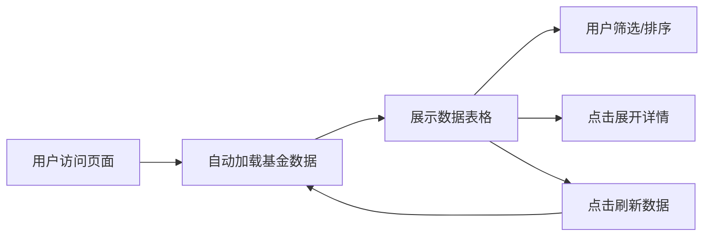

## 1. 产品概述

纳斯达克基金限额查询工具，帮助国内投资者快速了解当日QDII纳斯达克指数基金的限购情况和历史涨幅，辅助投资决策。

- 主要目的：聚合展示国内可投资的纳斯达克主题基金的实时限额信息，解决投资者查询多只基金限额信息繁琐的问题
- 目标用户：关注海外市场、投资QDII基金的个人投资者
- 产品价值：一站式获取最新基金限额数据，直观对比基金表现

## 2. 核心特性

### 2.1 功能模块

1. **首页**：基金数据表格展示、数据刷新、筛选功能
2. **基金详情**：单只基金的详细信息展示（点击展开）

### 2.2 页面详情

| 页面名称 | 模块名称 | 功能描述 |
|-----------|-------------|---------------------|
| 首页 | 头部区域 | 页面标题、副标题说明、最后更新时间、刷新按钮 |
| 首页 | 筛选区域 | 按限额状态筛选（不限购、限购、暂停申购）、按涨幅排序 |
| 首页 | 数据表格 | 展示基金名称、基金代码、基金限额、近一年涨幅、操作 |
| 首页 | 基金详情行 | 点击展开查看基金公司、成立日期、规模等详细信息 |
| 首页 | 底部区域 | 数据来源说明、风险提示 |

## 3. 核心流程

用户访问网站 → 自动获取并展示最新基金数据 → 用户可筛选/排序数据 → 点击基金行查看详情 → 点击刷新获取最新数据

## 4. 用户界面设计

### 4.1 设计风格

- **主色调**：深靛蓝（#1e3a5f），代表金融专业感和信任感
- **辅助色**：
  - 绿色（#10b981）：表示涨幅为正、不限购
  - 红色（#ef4444）：表示涨幅为负、暂停申购
  - 橙色（#f59e0b）：表示有限额
- **中性色**：深灰背景（#0f172a）、卡片浅灰（#1e293b）、白色文字
- **按钮风格**：圆角8px，悬停有微缩放效果，主按钮为渐变色
- **字体**：
  - 标题：使用优雅的衬线字体（如 Playfair Display 或国内的思源宋体）
  - 正文：使用现代无衬线字体（如 Noto Sans SC）
- **布局风格**：卡片式布局，顶部导航栏，居中内容区
- **视觉效果**：
  - 微妙的渐变背景
  - 卡片阴影和悬停效果
  - 数据加载动画
  - 表格行展开/收起过渡动画

### 4.2 页面设计概览

| 页面名称 | 模块名称 | UI元素 |
|-----------|-------------|-------------|
| 首页 | 头部区域 | 大标题、副标题、渐变装饰条、更新时间标签、刷新按钮 |
| 首页 | 筛选区域 | 圆角筛选标签组、排序下拉框 |
| 首页 | 数据表格 | 斑马纹、涨跌颜色标识、限额状态徽章、可点击行提示 |
| 首页 | 基金详情 | 网格布局展示详细信息、动画展开效果 |
| 首页 | 底部区域 | 小号文字、风险提示、数据来源标注 |

### 4.3 响应式设计

- **设计策略**：桌面优先，移动端自适应
- **桌面端（≥1024px）**：完整表格展示，4列数据，侧边留白
- **平板端（768px-1023px）**：完整表格展示，减少侧边留白
- **移动端（<768px）**：
  - 表格转为卡片式列表，每张卡片展示一只基金
  - 关键指标使用大字号突出显示
  - 筛选区域转为可折叠菜单
  - 优化触摸交互区域（按钮最小44x44px）
- **触摸优化**：增加点击区域，避免误触，支持下拉刷新
