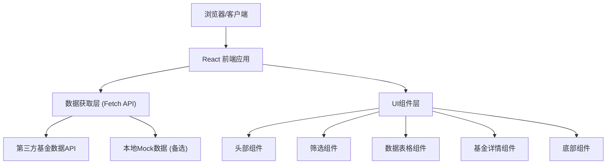

## 1. 架构设计



## 2. 技术描述

- **前端框架**：React@18 + TypeScript
- **构建工具**：Vite@5
- **样式方案**：Tailwind CSS@3
- **状态管理**：React Hooks (useState, useEffect)
- **数据获取**：原生 Fetch API
- **图标库**：Lucide React
- **动画方案**：CSS Transitions + Tailwind 动画类
- **部署平台**：Vercel
- **代码仓库**：GitHub

## 3. 目录结构

```
fund-limit/
├── src/
│   ├── components/          # React 组件
│   │   ├── Header.tsx       # 页面头部
│   │   ├── FilterBar.tsx    # 筛选栏
│   │   ├── FundTable.tsx    # 基金数据表格
│   │   ├── FundCard.tsx     # 移动端基金卡片
│   │   ├── FundDetail.tsx   # 基金详情展开
│   │   ├── Footer.tsx       # 页面底部
│   │   └── Loading.tsx      # 加载状态
│   ├── hooks/               # 自定义 Hooks
│   │   └── useFundData.ts   # 基金数据获取 Hook
│   ├── types/               # TypeScript 类型定义
│   │   └── fund.ts          # 基金相关类型
│   ├── utils/               # 工具函数
│   │   ├── format.ts        # 格式化工具
│   │   └── mock.ts          # Mock数据
│   ├── App.tsx              # 主应用组件
│   ├── main.tsx             # 应用入口
│   └── index.css            # 全局样式
├── public/                  # 静态资源
├── index.html               # HTML 模板
├── vite.config.ts           # Vite 配置
├── tailwind.config.js       # Tailwind 配置
├── tsconfig.json            # TypeScript 配置
├── package.json             # 项目依赖
└── vercel.json              # Vercel 配置
```

## 4. 数据模型

### 4.1 基金数据类型定义

```typescript
// 基金限额状态
type FundLimitStatus = 'unlimited' | 'limited' | 'suspended';

// 基金数据接口
interface Fund {
  id: string;
  code: string;           // 基金代码
  name: string;           // 基金名称
  limitStatus: FundLimitStatus;  // 限额状态
  limitAmount?: number;   // 限额金额（元），无限购时为undefined
  oneYearReturn: number;  // 近一年涨幅（百分比）
  company: string;        // 基金公司
  establishDate: string;  // 成立日期
  fundSize: number;       // 基金规模（亿元）
  fundType: string;       // 基金类型
  riskLevel: string;      // 风险等级
  lastUpdated: string;    // 数据更新时间
}

// 筛选条件
interface FilterOptions {
  status: 'all' | FundLimitStatus;
  sortBy: 'name' | 'code' | 'limit' | 'return';
  sortOrder: 'asc' | 'desc';
}
```

### 4.2 Mock 数据结构

由于真实基金数据API可能需要付费或有访问限制，项目将包含完整的Mock数据，模拟国内主要纳斯达克主题基金的真实数据。数据将包含：

- 广发纳斯达克100指数
- 国泰纳斯达克100指数
- 华安纳斯达克100指数
- 大成纳斯达克100指数
- 易方达纳斯达克100指数
- 华夏纳斯达克100指数
- 博时纳斯达克100指数
- 嘉实纳斯达克100指数
- 南方纳斯达克100指数
- 工银瑞信纳斯达克100指数

每只基金包含完整的限额状态、涨幅、基金公司等信息。

## 5. 响应式设计实现

- **断点定义**（Tailwind 默认断点）：
  - `sm`：640px - 小屏手机
  - `md`：768px - 大屏手机/小平板
  - `lg`：1024px - 平板/小屏桌面
  - `xl`：1280px - 标准桌面
  - `2xl`：1536px - 大屏桌面

- **实现策略**：
  - 使用 Tailwind 的响应式前缀（`md:hidden`, `lg:block` 等）
  - 桌面端使用 `<table>` 元素展示数据
  - 移动端使用卡片列表，每只基金一张卡片
  - 关键数据在移动端使用更大字号突出显示

## 6. 部署配置

### Vercel 配置 (vercel.json)

```json
{
  "buildCommand": "npm run build",
  "outputDirectory": "dist",
  "framework": "vite",
  "rewrites": [
    { "source": "/(.*)", "destination": "/index.html" }
  ]
}
```

### Git 忽略文件 (.gitignore)

```
node_modules
dist
dist-ssr
*.local
.env
.env.*
!.env.example
.vscode/*
!.vscode/extensions.json
.idea
.DS_Store
*.suo
*.ntvs*
*.njsproj
*.sln
*.sw?
```

## 7. 性能优化

- **代码分割**：Vite 自动进行路由级代码分割
- **图片优化**：使用 WebP 格式，懒加载图片
- **数据缓存**：使用 `localStorage` 缓存基金数据，设置过期时间
- **防抖处理**：筛选和搜索操作添加防抖
- **动画优化**：使用 CSS transforms 和 opacity 实现高性能动画
